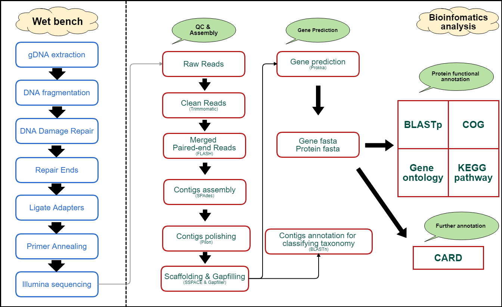

```{r setup, include=FALSE}
knitr::opts_chunk$set(echo = TRUE, fig.align="center")
```

***

### Introduction

- In this application, reads were sequenced by Illumina platform, mostly MiSeq is preferred. Adapters and Low quality bases are removed by "Trimmomatic".

- We are using "shovill" package for the whole assembly pipeline. Detail information please refer to "Assembly tag" on the top of panel.

- After genome assembly completed, we are using "Prokka" as the prokaryotic gene prediction tool which is packaged with multiple functions including: (a) various RNA prediction, like rRNA, tRNA, tmRNA and miscRNA; (b) Gene / CDS prediction.

- While we got multiple predicted proteins, followed with protein group function annotation which is blasted against with COG database, extracting gene ontology (GO) data by interproscan and using other scripts to generate KEGG functional pathway annotation according to their EC (enzyme commission) number.

- Finally, we infer that user is interesting on the antibiotic-resistant gene. A powerful tool - CARD (Comprehensive Antibiotic Resistance Database) is adding on our analysis report.

***

### Flow Chart

```{r, out.width = "600px", echo=FALSE, message=FALSE, warning=FALSE}

```
