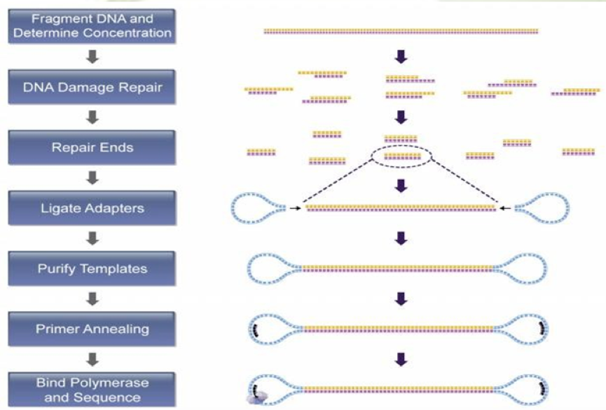
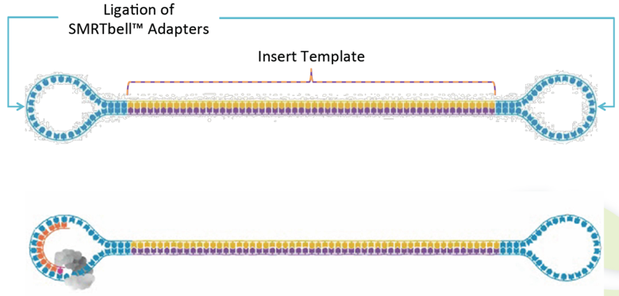
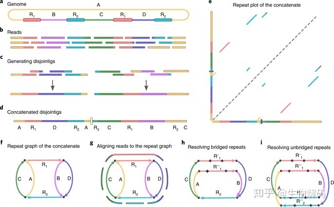

```{r setup, include=FALSE}
knitr::opts_chunk$set(echo = TRUE, fig.align="center")
```

***

```
If you are not familiar with the glossary of Pacbio technology, please also refer to 'Pacbio Terminology' PDF on the right-top corner
```

# Library Preparation Part  

### Pipeline of Experiment

Genomic DNA is extracted and fragmented randomly and then required length DNA fragments are retained by electrophoresis. And after this, we ligate adapters to DNA fragments then conduct cluster preparation, sequencing finally. The library preparation method and sequencing pipeline is shown below.

<br>

```{r, out.width = "600px", echo=FALSE, message=FALSE, warning=FALSE}

```

<br>

Figure 1: Pipeline of PacBio large-insert library construction and sequencing experiment. 
The library construction was followed by the manufacture of SMRTbell Express template Prep Kit 2.0 (PB100-938-900). First, genomic DNA was sheared by Covaris g-TUBE (Part Number: 520079) and purified via AMPure PB beads (Part Number: PB100-265-900). After damage repairing and end repairing, the A-tailed inserts were ligated with T-tailed adaptors and removed small insert SMRTbell templates by performing size selection with the BluePippin System. The final SMRTbells were annealed with sequencing primers and bound to the proprietary polymerase using the Sequel Binding Kit v3.0 (Part Number PB100-626-600) to form the Binding Complex. After dilution, the library was loaded onto the instrument with Sequel Sequencing Kit 3.0 (Part Number PB101-597-900) and SMRT Cell 1M v3 Tray (PB101-531-000 or PB101-531-001) for sequencing. A primary filtering analysis was performed with the Sequel instrument, and the secondary analysis was performed using the SMRT analysis pipeline version 7.0.

https://www.pacb.com/wp-content/uploads/Procedure-Checklist-Preparing-gDNA-Libraries-Using-the-SMRTbell-Express-Template-Preparation-Kit-2.0.pdf

***

# Sequencing Part

<br>

### SMRTbell™ template

A double-stranded DNA template capped by hairpin adapters (i.e., SMRTbell adapters) at both ends.

<br>

```{r, out.width = "400px", echo=FALSE, message=FALSE, warning=FALSE}

```

***

### Primary analysis

#### (Polymerase read -> Pre-filtered subreads)

On-instrument analysis which includes signal processing of the movie, base calling of the traces and pulses, and quality assessment of the base calls. Subsequently, it trims the sequences to the high-quality (HQ) regions, identifies adapter, barcode (optional), and control sequence reads, assigns read scores, and outputs the subread data in a BAM file.

<br>

```{r, out.width = "400px", echo=FALSE, message=FALSE, warning=FALSE}
knitr::include_graphics("images/Primary_analysis.png")
```

***

### Secondary analysis

#### (Pre-filtered subreads -> Post-filtered subreads)

Follows primary analysis and uses basecalled data. It is application-specific, and may include:

- Filtering/selection of data that meets a desired criteria (such as quality, read length, etc.).

- Comparison of reads to a reference or between each other for mapping and variant calling, consensus sequence determination, alignment and assembly (de novo or reference-based), variant identification, etc.

- Quality evaluations for a sequencing run, consensus sequence, assembly, etc.

- PacBio's SMRT Analysis contains a variety of secondary analysis applications including RNA and Epigenomics analysis tools.

<br>

```{r, out.width = "400px", echo=FALSE, message=FALSE, warning=FALSE}
knitr::include_graphics("images/Secondary_analysis.png")
```

***

### How does flye assembler work - Repeat graph

Flye is using repeat graph as a core data structure. In difference to de Bruijn graphs (which require exact k-mer matches), repeat graphs are built using approximate sequence matches, and can tolerate higher noise of SMS reads.

The edges of repeat graph represent genomic sequence, and nodes define the junctions. Each edges is classified into unique or repetitive. The genome traverses the graph (in an unknown way), so as each unique edge appears exactly once in this traversal. Repeat graphs reveal the repeat structure of the genome, which helps to reconstruct an optimal assembly.

<br>

```{r, out.width = "800px", echo=FALSE, message=FALSE, warning=FALSE}

```

***
