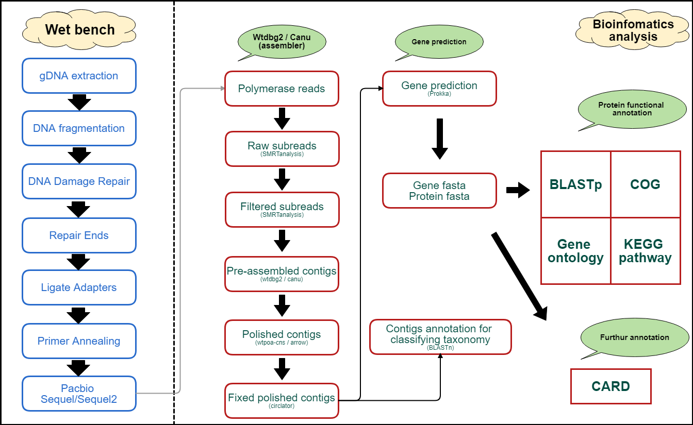

```{r setup, include=FALSE}
knitr::opts_chunk$set(echo = TRUE, fig.align="center")
```

***

### Introduction

- In this application, reads were sequenced by Pacbio Sequel/Sequel2 platform. Adapters and Low quality bases  will be removed by SMRT analysis, and transform polymerase reads into subreads. The longer subreads were assembled by "wtdbg2", polished by "wtpoa-cns" & "arrow" and circularized by "circlator".

- After genome assembly completed, we are using Prokka as gene prediction tool which is packaged with multiple functions including: (a) various RNA prediction, like rRNA, tRNA, tmRNA and miscRNA; (b) Gene / CDS prediction.

- While we got multiple predicted proteins, followed with protein group function annotation which is blasted against with COG database, extracting gene ontology (GO) data by interproscan and using other scripts to generate KEGG functional pathway annotation according to their EC (enzyme commission) number.

***

### Flow Chart

```{r, out.width = "600px", echo=FALSE, message=FALSE, warning=FALSE}

```

***

### File Repository 

```
PBxxx_report
├── 1_Assembly
│   ├── xxx_contig_summary.xlsx (fixed assembled contig summary)
│   ├── xxx_polished_assembly.fasta (raw draft genome by HGAP)
│   ├── xxx_polished_fixed.circularise.fasta (fixed circularise draft genome by Circlator)
│   └── AssemblyStats (general assembly report folder)
├── 2_Subreads
│   ├── Subreads/Assembly Result Summary Plot
├── 3_Prokka
│   ├── xxx.faa/fna/fsa/gbk/gff (gene prediction/annotation raw output)
│   └── README.txt (prokka output explanation)
├── 4_Annotation
│   ├── COG (protein group function annotation)
│   ├── GO (gene function ontology)
│   └── KEGG (functional pathway annotation)
├── xxx_contig_anno.xlsx (all of assembled contigs summary)
├── xxx_func_anno.xlsx (predicted genes annotation summary from prokka)
├── xxx_genomeMap.png (circular layout for the longest fixed assembled contig)
├── Help.pdf (general data explanation & how to use)
├── Pacific-Biosciences-Glossary-of-Terms.pdf (Pacbio terms explanation)
```

***

<!--
```{r cars}
summary(cars)
```

## Including Plots

You can also embed plots, for example:

```{r pressure, echo=FALSE}
plot(pressure)
```
-->
