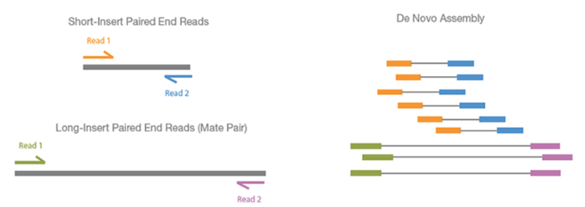

```{r setup, include=FALSE}
knitr::opts_chunk$set(echo = TRUE, fig.align="center")
```

***

## Library Preparation  

### Pipeline of Experiment

- Long RNAs are first converted into a library of cDNA fragments through either RNA fragmentation or DNA fragmentation.
- Sequencing adaptors (blue) are subsequently added to each cDNA fragment and a short sequence is obtained from each cDNA using high-throughput sequencing technology.
- The resulting sequence reads are aligned with the reference genome or transcriptome, and classified as three types: exonic reads, junction reads and poly(A) end-reads.
- These three types are used to generate a base-resolution expression profile for each gene, as illustrated at the bottom [1].

<br>

```{r, out.width = "300px", echo=FALSE, message=FALSE, warning=FALSE}

```

<br>

<a href="https://www.ncbi.nlm.nih.gov/pmc/articles/PMC4351865" target="_blank">Multiple Illumina Library Preparation Methods</a>: 

Please point to "NGS library construction using RNA" Section.

***

## Sequencing

<br>

### Paired-end/Mate-pair Sequencing & Assembly

```{r, out.width = "600px", echo=FALSE, message=FALSE, warning=FALSE}

```

- First, PCR amplify the individual DNA fragments once they have hybridized to flowcells or beads.  This means you end up with both strands of DNA.  If you were to read both of the strands from their respective 3′ ends at once, you’d be getting two different sequences and your results would be uninterpretable.  To avoid this problem, sequencing technologies ligate non-complementary adapters to the 3′ and 5′ ends of DNA fragments so that the primer for one adapter only begins synthesis on one strand and not on its complement.

- In conventional paired-end sequencing, you simply sequence using the adapter for one end, and then once you’re done you start over sequencing using the adapter for the other end.

- This means your two reads are the reverse complement of the 100 3′-most bases of the Watson strand and the Crick strand; these reads are assumed to be identical to the 100 5′-most bases of the Crick strand and Watson strand respectively.

***

## Assembly
Trinity, a novel method for the efficient and robust de novo reconstruction of transcriptomes from RNA-seq data. Trinity combines three independent software modules: Inchworm, Chrysalis, and Butterfly, applied sequentially to process large volumes of RNA-seq reads. Trinity partitions the sequence data into many individual de Bruijn graphs, each representing the transcriptional complexity at a given gene or locus, and then processes each graph independently to extract full-length splicing isoforms and to tease apart transcripts derived from paralogous genes. Briefly, the process works like so:

- Inchworm assembles the RNA-seq data into the unique sequences of transcripts, often generating full-length transcripts for a dominant isoform, but then reports just the unique portions of alternatively spliced transcripts.

__將RNA-seq的原始reads數據組裝成contigs__

- Chrysalis clusters the Inchworm contigs into clusters and constructs complete de Bruijn graphs for each cluster. Each cluster represents the full transcriptonal complexity for a given gene (or sets of genes that share sequences in common). Chrysalis then partitions the full read set among these disjoint graphs.

__將上一步生成的contigs聚類，然後對每個components構建de Bruijn圖__

- Butterfly then processes the individual graphs in parallel, tracing the paths that reads and pairs of reads take within the graph, ultimately reporting full-length transcripts for alternatively spliced isoforms, and teasing apart transcripts that corresponds to paralogous genes.

__處理這些de Bruijn圖，依據圖中reads和成對的reads來尋找路徑，從而得到具有選擇性剪接(Alternative splicing)的全長轉錄子，同時將旁系同源基因(paralogous)的轉錄子分開__

```{r, out.width = "600px", echo=FALSE, message=FALSE, warning=FALSE}

```

***

### Article Reference
```
1. http://home.cc.umanitoba.ca/~zhangx39/PLNT7690/presentation/presentation.html
2. http://www.sohu.com/a/228557308_761120
```

***
