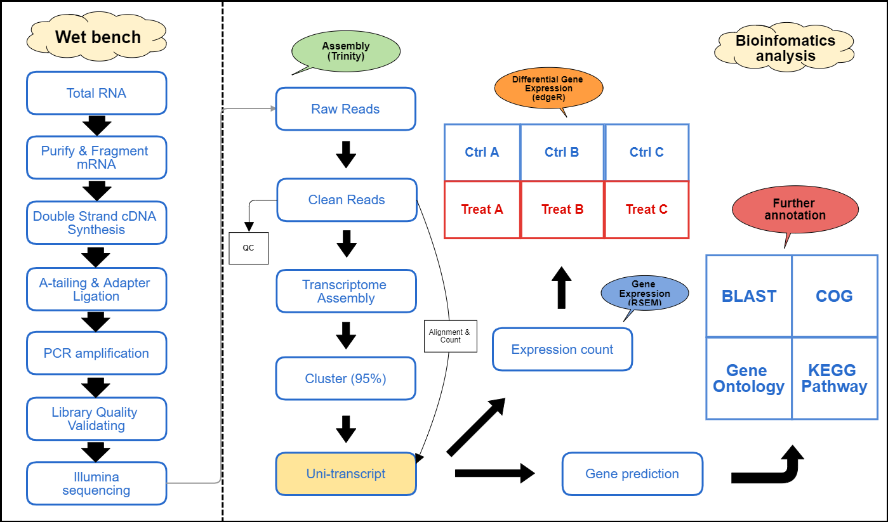

```{r setup, include=FALSE}
knitr::opts_chunk$set(echo = TRUE, fig.align="center")
```

***

### Introduction

- Large scale sequencing has been revolutionized by the introduction of several next-generation sequencing (NGS) technologies.
- RNA sequencing (RNA-seq) is the use of NGS for transcriptomics.
- Because it can generate an unlimited dynamic range, provide greater sensitivity than microarrays.RNA-seq has been hailed as the future of transcriptome research.
- RNA-seq is the first sequencing-based method that allows the entire transcriptome to be surveyed by high-throughput and quantitative manner. [1]

<br>

### De-novo/Genome-guide Assembly Pipeline

In this application, reads were sequenced by Illumina HiSeq platform. Adapters and Low quality bases will be removed by "Trimmomatic". **RNA-seq de-novo/reference-based assembly work from all pooling samples will be used for the assembler - "Trinity", which is a very popular, well-known and accurate for the transcriptome assembly**. After that, each sample's reads will be mapped back to the assembled transcriptome, and calculate the read count quantification, differential gene expression and furthur gene function annotation workflow.

<br>

### RNA Quantification Pipeline

In this application, reads were sequenced by Illumina HiSeq platform. Adapters and Low quality bases will be removed by "Trimmomatic". **The assembly process will be ignore. Each sample's RNA-seq clean reads are going to be mapped to known species genome directly**, and calculate the read count quantification, differential gene expression and furthur gene function annotation workflow.

<br>

### Transcript CDS Prediction
Transcript CDS prediction work is completed by "Transdecoder" which could help for identifying candidate coding regions within transcript sequences, such as those generated by de-novo/genome-guide RNA-Seq transcript assembly using Trinity.

<br>

### Further Annotation
While we got multiple predicted proteins, followed with

- Transcript homology search by blastx & blastp

- Protein group function annotation which is blasted against with COG database 

- Extracting gene ontology (GO) data 

- KEGG functional pathway annotation

<br>

### General Flow Chart
```{r, out.width = "600px", echo=FALSE, message=FALSE, warning=FALSE}

```

***

### Article Reference
```
1. http://home.cc.umanitoba.ca/~zhangx39/PLNT7690/presentation/presentation.html
```
***
