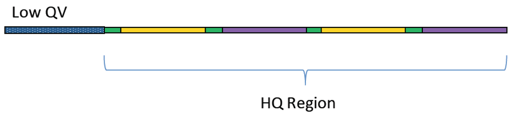
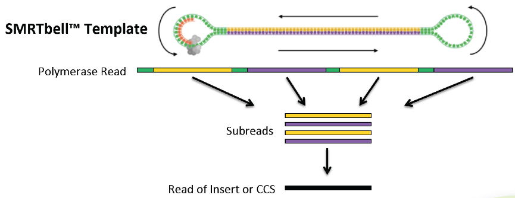

```{r setup, include=FALSE}
knitr::opts_chunk$set(echo = TRUE, fig.align="center")
```

***

```
If you are not familiar with the glossary of Pacbio technology, please also refer to 'Pacbio Terminology' PDF on the right-top corner
```

# Library Preparation Part  

### Pipeline of Experiment

The genomic DNA (1 μg) was sheared by Covaris g-TUBE (Covaris, 520079) and purified via AMPure PB beads (PacBio, 100-265-900). The sheared and purified DNA fragments were used as template to prepare SMRTbell library via SMRTbell template prep kit 1.0 (PacBio, 100-991-900), according to the manufacturer’s instructions. After damage repairing and end repairing, the A-tailed inserts were ligated with barcoded overhang adapters and removed small insert SMRTbell templates by performing size selection with the BluePippin System. The SMRT sequencing was performed on SMRT 1M Cell v3 (PacBio, 101-531-000) with chemistry version 3.0 on PacBio Sequel sequencer by Genomics BioSci & Tech Co. A primary filtering analysis was performed on the Sequel system, and the secondary analysis was performed using the SMRT analysis pipeline version 9.0.


<br>

```{r, out.width = "600px", echo=FALSE, message=FALSE, warning=FALSE}
knitr::include_graphics("images/PB_lib_pipe.png")
```

<br>

Figure 1: Pipeline of PacBio large-insert library construction and sequencing experiment. 

***

# Sequencing Part

<br>

### SMRTbell™ template

A double-stranded DNA template capped by hairpin adapters (i.e., SMRTbell adapters) at both ends.

<br>

```{r, out.width = "400px", echo=FALSE, message=FALSE, warning=FALSE}
knitr::include_graphics("images/SMRTBell.png")
```

***

### Primary analysis

#### (Polymerase read -> Pre-filtered subreads)

On-instrument analysis which includes signal processing of the movie, base calling of the traces and pulses, and quality assessment of the base calls. Subsequently, it trims the sequences to the high-quality (HQ) regions, identifies adapter, barcode (optional), and control sequence reads, assigns read scores, and outputs the subread data in a BAM file.

<br>

```{r, out.width = "400px", echo=FALSE, message=FALSE, warning=FALSE}

```

***

### Secondary analysis

#### (Pre-filtered subreads -> Post-filtered subreads)

Follows primary analysis and uses basecalled data. It is application-specific, and may include:

- Filtering/selection of data that meets a desired criteria (such as quality, read length, etc.).

- Comparison of reads to a reference or between each other for mapping and variant calling, consensus sequence determination, alignment and assembly (de novo or reference-based), variant identification, etc.

- Quality evaluations for a sequencing run, consensus sequence, assembly, etc.

- PacBio's SMRT Analysis contains a variety of secondary analysis applications including RNA and Epigenomics analysis tools.

<br>

```{r, out.width = "400px", echo=FALSE, message=FALSE, warning=FALSE}

```

***

### Bioinformatics Analysis

The hifi reads were generated by subreads with 3 passes and 0.99 predicted accuracy. They were going to be assembled by hifiasm v0.8. SSPACE-long v1.1 and PBJelly v15.8.24 were applied for scaffolding and gap closing, respectively. Then the genome was polishing by Arrow v2.3.3. Circlator v1.5.5 was performed to correct and circularize the genome. Finally, QUAST v4.6.3 was used for evaluating the assembled genome quality.


As de-novo assembled genome finished, we would like to know what kind of and how much of genes, RNAs, and other elements existed in genome. "Prokka v1.13" is a powerful tool which could help for finding bacteria origin of replication (ori), following with downstream gene/CDS/RNA sequence prediction and using blast method against the uniprot/swissprot bacterial database.


“InterProscan v5”, a database integrated together predictive information about proteins’ function from a number of partner resources, gives an overview of the families that a protein belongs to and the domains and sites it contains. We input all of the predicted protein sequences to the database and try to parse their GO terms. KEGG pathway is parsed by "ec2kegg.pl" which is using EC number to search KEGG specific organism enzyme pathway. 


Finally, we selected "CARD database v3.0.5" to dig out probably antibiotic resistance genes existed in novel assembled genome. "Resistance Gene Identifier (RGI) v5.1.0", which is a core software to predict resistomes from protein or nucleotide data, including metagenomics data, based on homology and SNP models. VFDB, Virulence Factors Database, was used to predicted the bacterial pathogen and their pathogenicity which may cause disease to the human.

***
