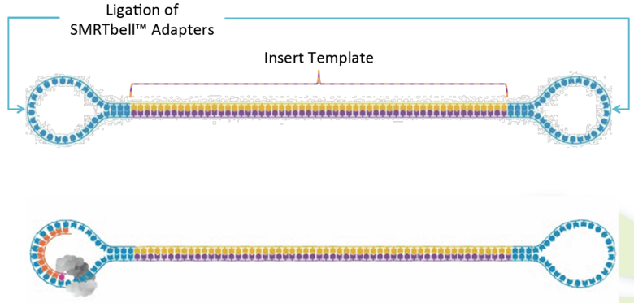

```{r, setup, include=FALSE}
knitr::opts_chunk$set(collapse = TRUE)
library(DT)
library(dplyr)
library(knitr)
library(kableExtra)
library(pander)
library(readxl)
library(plotly)
```

<!--- (index.html) -->

\newpage

# Introduction

- In this application, reads were sequenced by Pacbio Sequel/Sequel2 platform. Adapters and Low quality bases  will be removed by SMRT analysis, and transform polymerase reads into subreads. The longer subreads were assembled by "flye", polished by "arrow" and circularized by "circlator".

- After genome assembly completed, we are using Prokka as gene prediction tool which is packaged with multiple functions including: (a) various RNA prediction, like rRNA, tRNA, tmRNA and miscRNA; (b) Gene / CDS prediction.

- While we got multiple predicted proteins, followed with protein group function annotation which is blasted against with COG database, extracting gene ontology (GO) data by interproscan and using other scripts to generate KEGG functional pathway annotation according to their EC (enzyme commission) number.


### Flow Chart

```{r, fig.align = 'center', echo=FALSE, message=FALSE, warning=FALSE}

```

\newpage

<!--- (experiment.html) -->

# Experiment workflow


If you are not familiar with the glossary of Pacbio technology, 
please also refer to 
[Pacbio Terminology](https://www.pacb.com/wp-content/uploads/2015/09/Pacific-Biosciences-Glossary-of-Terms.pdf)

## Library Preparation 

Genomic DNA is extracted and fragmented randomly and then required length DNA fragments are retained by electrophoresis. And after this, we ligate adapters to DNA fragments then conduct cluster preparation, sequencing finally. The library preparation method and sequencing pipeline is shown below.

<br>

```{r, fig.align = 'center', echo=FALSE, message=FALSE, warning=FALSE}
knitr::include_graphics("images/PB_lib_pipe.png")
```

<br>

Figure 1: Pipeline of PacBio large-insert library construction and sequencing experiment.
The library construction was followed by the manufacture of SMRTbell Express template Prep Kit 2.0 (PB100-938-900). First, genomic DNA was sheared by Covaris g-TUBE (Part Number: 520079) and purified via AMPure PB beads (Part Number: PB100-265-900). After damage repairing and end repairing, the A-tailed inserts were ligated with T-tailed adaptors and removed small insert SMRTbell templates by performing size selection with the BluePippin System. The final SMRTbells were annealed with sequencing primers and bound to the proprietary polymerase using the Sequel Binding Kit v3.0 (Part Number PB100-626-600) to form the Binding Complex. After dilution, the library was loaded onto the instrument with Sequel Sequencing Kit 3.0 (Part Number PB101-597-900) and SMRT Cell 1M v3 Tray (PB101-531-000 or PB101-531-001) for sequencing. A primary filtering analysis was performed with the Sequel instrument, and the secondary analysis was performed using the SMRT analysis pipeline version 8.0

https://www.pacb.com/wp-content/uploads/Procedure-Checklist-Preparing-gDNA-Libraries-Using-the-SMRTbell-Express-Template-Preparation-Kit-2.0.pdf


## Sequencing

<br>

### SMRTbell™ template

A double-stranded DNA template capped by hairpin adapters (i.e., SMRTbell adapters) at both ends.

<br>

```{r, fig.align = 'center', echo=FALSE, message=FALSE, warning=FALSE}

```


### Primary analysis

#### (Polymerase read -> Pre-filtered subreads)

On-instrument analysis which includes signal processing of the movie, base calling of the traces and pulses, and quality assessment of the base calls. Subsequently, it trims the sequences to the high-quality (HQ) regions, identifies adapter, barcode (optional), and control sequence reads, assigns read scores, and outputs the subread data in a BAM file.

<br>

```{r, fig.align = 'center', echo=FALSE, message=FALSE, warning=FALSE}
knitr::include_graphics("images/Primary_analysis.png")
```


### Secondary analysis

#### (Pre-filtered subreads -> Post-filtered subreads)

Follows primary analysis and uses basecalled data. It is application-specific, and may include:

- Filtering/selection of data that meets a desired criteria (such as quality, read length, etc.).

- Comparison of reads to a reference or between each other for mapping and variant calling, consensus sequence determination, alignment and assembly (de novo or reference-based), variant identification, etc.

- Quality evaluations for a sequencing run, consensus sequence, assembly, etc.

- PacBio's SMRT Analysis contains a variety of secondary analysis applications including RNA and Epigenomics analysis tools.

<br>

```{r, fig.align = 'center', echo=FALSE, message=FALSE, warning=FALSE}
knitr::include_graphics("images/Secondary_analysis.png")
```


## How does flye assembler work - Repeat graph

Flye is using repeat graph as a core data structure. In difference to de Bruijn graphs (which require exact k-mer matches), repeat graphs are built using approximate sequence matches, and can tolerate higher noise of SMS reads.

The edges of repeat graph represent genomic sequence, and nodes define the junctions. Each edges is classified into unique or repetitive. The genome traverses the graph (in an unknown way), so as each unique edge appears exactly once in this traversal. Repeat graphs reveal the repeat structure of the genome, which helps to reconstruct an optimal assembly.

<br>

```{r, fig.align = 'center', echo=FALSE, message=FALSE, warning=FALSE}
knitr::include_graphics("images/flye_pipe.jpg")
```

\newpage

<!--- (assembly.html) -->

# WorkFlow of Assembly Pipeline


## Final Assembly Summary


[Flye + SSPACE-Long + Arrow assembled scaffolds (.fasta)](files/1_Assembly/<prefix>.scaffolds.polished.fasta)

a.) Contigs were assembled by Flye.

b.) Scaffolds were generated by SSPACE-Long

c.) Polished scaffolds were polished by Arrow

### FixStart and Circularising polished scaffolds by Circlator

a.) Identify each circular sequence and output a linearised version of it.

b.) Join contigs together.

c.) If a dnaA gene is found, then that is used as the starting position.

[FixStart and circularised contigs (.fasta)](files/1_Assembly/<prefix>_polished_fixed.circularise.fasta) <--- final completed genome, used for following analysis

[Assembly Report by QUAST (.html)](files/1_Assembly/quast/report.html) <--- assembly evaluation

&nbsp;

```{r, echo=FALSE, message=FALSE, warning=FALSE}
fixed_polished_report <- read.table("files/1_Assembly/quast/report.tsv", header=T, check.names=F, sep="\t")

kable(fixed_polished_report, "latex", caption = "Summary of Assembly Results", format.args = list(big.mark = ","), booktabs = T, digits = 0, align = 'lccc') %>%
  kable_styling(latex_options = c("striped","hold_position","scale_down"))
```


### Step 1.) Assembly from PacBio subreads: "Flye v2.7"[1]

Flye, a long-read assembly algorithm that generates arbitrary paths in an unknown repeat graph, called disjointigs, and constructs an accurate repeat graph from these error-riddled disjointigs.

For more detail of each step of assembly algorithms, please view the introduction:

[flye detail introduction](https://github.com/fenderglass/Flye/blob/flye/docs/USAGE.md)

&nbsp;

### Step 2.) Scaffolding + Gap closing + Polishing

1. Scaffolding by "SSPACE-Long v1.1 [2]"

SSPACE-LongRead is a stand-alone program for scaffolding pre-assembled contigs using long reads (e.g. PacBio RS reads). Using the long read information, contigs (or scaffolds) are placed in the right order and orientation in so-called super-scaffolds.

&nbsp;

2. Gap closing by "PBJelly v15.8.24 [3]"

PBJelly is software for closing gaps in genome assemblies using long reads [https://doi.org/10.1371/journal.pone.0047768].

&nbsp;

3. Genome polishing by "Arrow v2.3.3" [4]

The GenomicConsensus package provides the variantCaller tool, which allows you to apply the Arrow algorithm to mapped PacBio reads to get consensus and variant calls.

https://github.com/PacificBiosciences/GenomicConsensus

&nbsp;

### Step 3.) FixStart & Circularization: "circlator v1.5.5" [5]

Current long-read assembly software still typically assumes that the contigs they produce are linear.

In contrast, the genome of almost every species contains at least one circular DNA structure, such as bacterial chromosomes and plasmids.

Thus, a useful circularization of genome assembly tool – “Circlator v1.5.5” is our default pipeline to correct and linearize the genome.

&nbsp;

### Step 4.) Assembly evaluation: "QUAST v4.6.3" [6]

Finally, we are using QUAST for evaluating the assembled genome quality.


&nbsp;

### Reference
1. Flye v2.7: Fast and accurate de novo assembler for single molecule sequencing reads
Mikhail Kolmogorov, Jeffrey Yuan, Yu Lin & Pavel A. Pevzner. (2019) doi:10.1038/s41587-019-0072-8

2. SSPACE-Long v1.1: SSPACE-LongRead is a stand-alone program for scaffolding pre-assembled contigs using long reads (e.g. PacBio subreads).
Boetzer M, Pirovano W (2014) SSPACE-LongRead: scaffolding bacterial draft genomes using long read sequence information. BMC Bioinformatics, 15:211.

3. PBJelly v15.8.24: PBJelly is software for closing gaps in genome assemblies using long reads 
Adam C. English ,Stephen Richards,Yi Han,Min Wang,Vanesa Vee,Jiaxin Qu,Xiang Qin,Donna M. Muzny,Jeffrey G. Reid,Kim C. Worley,Richard A. Gibbs
doi.org/10.1371/journal.pone.0047768

4. Arrow v2.3.3: The GenomicConsensus package provides the variantCaller tool, which allows you to apply the Arrow algorithm to mapped PacBio reads to get consensus and variant calls.
https://github.com/PacificBiosciences/GenomicConsensus

5. "Circlator v1.5.5" - fix start & improvement draft genome
Hunt M, Silva ND, Otto TD, Parkhill J, Keane JA, Harris SR. Circlator: automated circularization of genome assemblies using long sequencing reads. Genome Biology. 2015;16:294. 
doi:10.1186/s13059-015-0849-0.

6. "QUAST v4.6.3" - Assembly evalutation
Gurevich A., Saveliev V., Vyahhi N., Tesler G. QUAST: quality assessment tool for genome assemblies. Bioinformatics, 2013.

\newpage

<!-- annotation.html -->

# Gene Prediction & Annotation

## Prokka: Rapid prokaryotic genome annotation

Whole genome annotation is the process of identifying features of interest in a set of genomic DNA sequences, and labelling them with useful information. “Prokka v1.12” is a software tool to annotate bacterial, archaeal and viral genomes quickly and produce standards-compliant output files [4].

As de-novo assembled genome finished, we would like to know what kind of and how much of genes, RNAs, and other elements existed in genome. Prokka is a powerful tool which could help for finding bacteria origin of replication (ori), following with downstream gene/CDS/RNA sequence prediction and using blast method against the uniprot/swissprot bacterial database.

&nbsp;

```{r, echo=FALSE, message=FALSE, warning=FALSE}
df <- read.table("files/3_Prokka/<prefix>.txt", header=T, check.names=F, sep="\t")

kable(df, "latex", caption = "Summary of Prokka Gene Prediction", format.args = list(big.mark = ","), booktabs = T, digits = 0, align = 'lc') %>%
  kable_styling(latex_options = c("striped","hold_position"))
```

```{r, prop_table, echo=FALSE, message=FALSE, warning=FALSE, results = 'asis'}
df <- read.table("files/3_Prokka/README.txt", header=T, check.names=F, sep="\t")
df$Extension <- paste0("[",df$Extension,"]","(files/3_Prokka/<prefix>",df$Extension,")")
pandoc.table(df, style = "grid")
```


&nbsp;

\newpage


## Nucleotide BLAST (Contig annotation)

__Database: NCBI nt (all species)__

[Contigs Annotation Table Download (.xlsx)](files/<prefix>_contig_anno.xlsx)

```{r, echo=FALSE, message=FALSE, warning=FALSE}
nucl_blast <- read_excel("files/<prefix>_contig_anno.xlsx", n_max = 9)
kable(nucl_blast[1:4], "latex", caption = "Summary of BLASTn (partial)", format.args = list(big.mark = ","), booktabs = T, digits = 0, align = 'lccc') %>%
  kable_styling(latex_options = c("striped","hold_position"))
#pander::pander(nucl_blast, style = 'grid')
```

&nbsp;
&nbsp;
&nbsp;

## Protein BLAST (Functional annotation)

__Database: Customized Uniprot SwissProt+Trembl__

[Protein Function Table Download (.xlsx)](files/<prefix>_func_anno.xlsx)

```{r, echo=FALSE, message=FALSE, warning=FALSE}
nucl_blast <- read_excel("files/<prefix>_func_anno.xlsx", n_max = 10)
kable(nucl_blast[1:8], "latex", caption = "Summary of BLASTp (partial)", format.args = list(big.mark = ","), booktabs = T, digits = 0, align = 'lccc') %>%
  kable_styling(latex_options = c("striped","hold_position"))
```

&nbsp;
&nbsp;
&nbsp;

\newpage

## Protein Group Orthologue (COG)

In order to extract the maximum amount of information from the rapidly accumulating genome sequences, all conserved genes need to be classified according to their homologous relationships. Each COG consists of individual orthologous proteins or orthologous sets of paralogs from at least three lineages. Orthologs typically have the same function, allowing transfer of functional information from one member to an entire COG.

[COG Table Download (.xlsx)](files/4_Annotation/COG/rps-blast_cog.txt.xlsx)

```{r, echo=FALSE, message=FALSE, warning=FALSE}
cog_report <- read_excel("files/4_Annotation/COG/rps-blast_cog.txt.xlsx", n_max = 10)
kable(cog_report[1:6], "latex", caption = "Summary of Protein Group Orthologue (partial)", format.args = list(big.mark = ","), booktabs = T, digits = 0, align = 'lccc') %>%
  kable_styling(latex_options = c("striped","hold_position"))
```

&nbsp;

```{r, echo=FALSE, message=FALSE, warning=FALSE}
knitr::include_graphics("files/4_Annotation/COG/cog_barchart.png")
```

&nbsp;
&nbsp;
&nbsp;

\newpage

## Gene Ontology (GO)

Gene ontology concern with annotation of genes and gene products and to provide centralized access to resources and tools. both GO and COG provide specific information about gene or gene products.

__There are three main classes in GO database:__

__1. Cellular Component: These terms describe a component of a cell that is part of a larger object, such as an anatomical structure (e.g. rough endoplasmic reticulum or nucleus) or a gene product group (e.g. ribosome, proteasome or a protein dimer).__

__2.Biological Process: A biological process term describes a series of events accomplished by one or more organized assemblies of molecular functions.__

__3. Molecular Function: Molecular function terms describes activities that occur at the molecular level, such as "catalytic activity" or "binding activity".__

“InterProscan v5” is a database which integrates together predictive information about proteins' function from a number of partner resources, giving an overview of the families that a protein belongs to and the domains and sites it contains. We input all of the predicted protein sequences to the database and try to parse their GO terms. [5]


[GO Table Download (.xlsx)](files/4_Annotation/GO/GO_mapping.txt.xlsx)

```{r, echo=FALSE, message=FALSE, warning=FALSE}
go_report <- read_excel("files/4_Annotation/GO/GO_mapping.txt.xlsx", n_max = 10)
kable(go_report[1:4], "latex", caption = "Summary of Gene Ontology (partial)", format.args = list(big.mark = ","), booktabs = T, digits = 0, align = 'lccc') %>%
  kable_styling(latex_options = c("striped","hold_position"))
```

&nbsp;

```{r, echo=FALSE, message=FALSE, warning=FALSE}
knitr::include_graphics("files/4_Annotation/GO/GO_barchart.png")
```

&nbsp;
&nbsp;
&nbsp;

\newpage

## KEGG pathway (KEGG)

KEGG PATHWAY is a collection of manually drawn pathway maps representing our knowledge on the molecular interaction, reaction and relation networks for:

__1. Metabolism: Global/overview, Carbohydrate, Energy, Lipid, Nucleotide, Amino acid, Other amino, Glycan, Cofactor/vitamin, Terpenoid/PK, Other secondary metabolite, Xenobiotics, Chemical structure__

__2. Genetic Information Processing__

__3. Environmental Information Processing__

__4. Cellular Processes__

__5. Organismal Systems__

__6. Human Diseases__

__7. Drug Development__


```{r, echo=FALSE, message=FALSE, warning=FALSE}
kegg_report <- read_excel("files/4_Annotation/KEGG/<prefix>_ec2kegg.xls", n_max = 10)
kable(kegg_report[1:4], "latex", caption = "Summary of KEGG Pathway (partial)", format.args = list(big.mark = ","), booktabs = T, digits = 0, align = 'lccc') %>%
  kable_styling(latex_options = c("striped","hold_position"))
```

```{r, echo=FALSE, message=FALSE, warning=FALSE}
knitr::include_graphics("files/4_Annotation/KEGG/kegg_barchart.png")
```

&nbsp;
&nbsp;
&nbsp;

\newpage

## The Comprehensive Antibiotic Resistance Database (CARD)

<a href="https://card.mcmaster.ca/home" target="_blank">CARD official website</a>

A bioinformatic database of resistance genes, their products and associated phenotypes.

4094 Ontology Terms, 2570 Reference Sequences, 1233 SNPs, 2513 Publications, 2622 AMR Detection Models

Resistome predictions: 82 pathogens, 5524 chromosomes, 7305 plasmids, 76710 WGS assemblies, 175753 alleles


<a href="https://github.com/arpcard/rgi" target="_blank">RGI analysis software</a>

Resistance Gene Identifier (RGI). Software to predict resistomes from protein or nucleotide data, including metagenomics data, based on homology and SNP models.

[CARD Table Download (.xlsx)](files/4_Annotation/<prefix>_card.xlsx)

```{r, echo=FALSE, message=FALSE, warning=FALSE}
card <- read_excel("files/4_Annotation/<prefix>_card.xlsx", n_max = 10)
kable(card[1:6], "latex", caption = "Summary of CARD results (partial)", format.args = list(big.mark = ","), booktabs = T, digits = 0, align = 'lccc') %>%
  kable_styling(latex_options = c("striped","hold_position"))
```

&nbsp;
&nbsp;
&nbsp;

\newpage

## Longest Chromosome Plot

```{r, echo=FALSE, message=FALSE, warning=FALSE}
knitr::include_graphics("files/<prefix>_genomeMap.png")
```

&nbsp;
&nbsp;
&nbsp;

\newpage

## Final Summary Table

[Contigs Annotation Full Table](files/<prefix>_contig_anno.xlsx)

[Function Annotation Full Table](files/<prefix>_func_anno.xlsx)

&nbsp;
&nbsp;
&nbsp;

## Reference
```
1. "Prokka v1.13" - Prokaryotic gene prediction
(https://github.com/tseemann/prokka)

2. "InterProScan 5" - Protein functional annotation
(https://github.com/ebi-pf-team/interproscan/wiki)

3. "CARD v3.0.5" - The Comprehensive Antibiotic Resistance Database
(https://card.mcmaster.ca/home)

4. "RGI v5.1.0" - Resistance Gene Identifier
(https://github.com/arpcard/rgi)
```

\newpage

# Useful Tools

1. [Notepad++](https://notepad-plus-plus.org/): 適合觀看所有Linux產出的文字或序列檔

2. [Comma separator](https://delim.co/): 分隔符號轉換工具

3. [Venny diagram](http://bioinfogp.cnb.csic.es/tools/venny/): 多個樣品取交集基因

4. [REVIGO](http://revigo.irb.hr/): 視覺化GO data

5. [Uniprot database](http://www.uniprot.org/): 三大蛋白質資料庫之一

6. [ID mapping](http://www.uniprot.org/mapping/: 任意轉換Uniprot ID到不同的資料庫（實用！）)

7. [KEGG Mapper - Search & Color Pathway](https://www.genome.jp/kegg/tool/map_pathway2.html): 透過KEGG網站搜索enzyme或基因的代謝路徑


