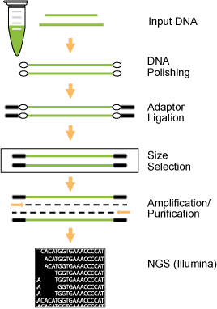
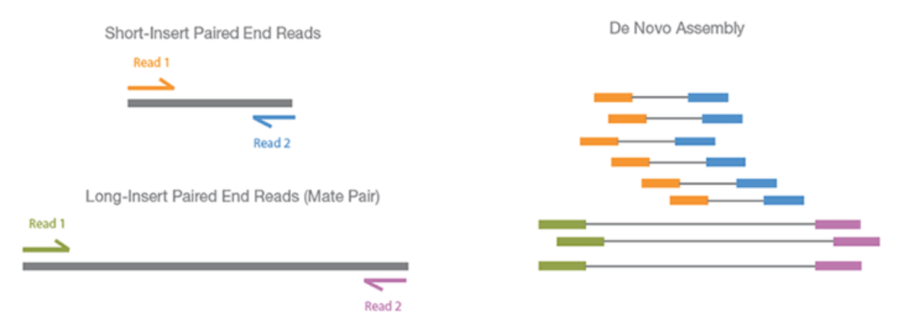

```{r setup, include=FALSE}
knitr::opts_chunk$set(echo = TRUE, fig.align="center")
```

***

# Library Preparation Part  

### Pipeline of Experiment

Genomic DNA is extracted and fragmented randomly and then required length DNA fragments are retained by electrophoresis. And after this, we ligate adapters to DNA fragments then conduct cluster preparation, sequencing finally. The library preparation method and sequencing pipeline is shown below.

<br>

```{r, out.width = "300px", echo=FALSE, message=FALSE, warning=FALSE}

```

***

<a href="https://www.ncbi.nlm.nih.gov/pmc/articles/PMC4351865" target="_blank">Multiple Illumina Library Preparation Methods</a>: 

Please point to "NGS library construction using fragmented/size selected DNA" Section.

***

# Sequencing Part

<br>

### Paired-end/Mate-pair Sequencing & Assembly

```{r, out.width = "600px", echo=FALSE, message=FALSE, warning=FALSE}

```

***

- First, PCR amplify the individual DNA fragments once they have hybridized to flowcells or beads.  This means you end up with both strands of DNA.  If you were to read both of the strands from their respective 3′ ends at once, you’d be getting two different sequences and your results would be uninterpretable.  To avoid this problem, sequencing technologies ligate non-complementary adapters to the 3′ and 5′ ends of DNA fragments so that the primer for one adapter only begins synthesis on one strand and not on its complement.

- In conventional paired-end sequencing, you simply sequence using the adapter for one end, and then once you’re done you start over sequencing using the adapter for the other end.

- This means your two reads are the reverse complement of the 100 3′-most bases of the Watson strand and the Crick strand; these reads are assumed to be identical to the 100 5′-most bases of the Crick strand and Watson strand respectively.

***
