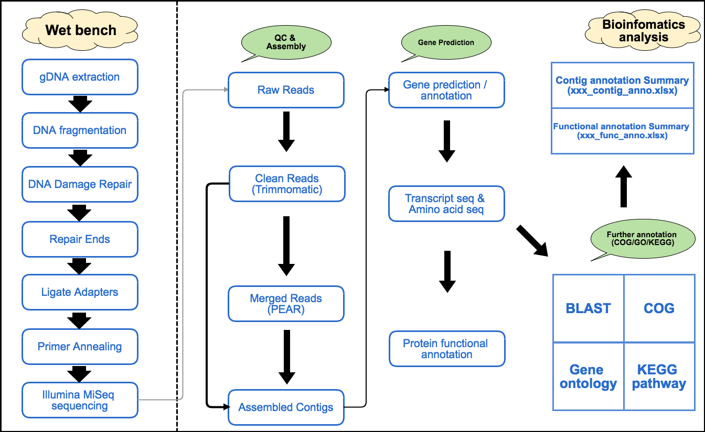

```{r setup, include=FALSE}
knitr::opts_chunk$set(echo = TRUE, fig.align="center")
```

***

### Introduction

- In this application, reads were sequenced by MiSeq platform. Adapters and Low quality bases are removed by "Trimmomatic", and we also merged read 1 and read 2 by "PEAR" to help for improving the assembly on hard-to-assemble region. Assembly work is using "SPAdes" which is a very popular, fast and accurate for the genome assembly.

- After genome assembly completed, we are using Prokka as gene prediction tool which is packaged with multiple functions including: (a) various RNA prediction, like rRNA, tRNA, tmRNA and miscRNA; (b) Gene / CDS prediction.

- While we got multiple predicted proteins, followed with protein group function annotation which is blasted against with COG database, extracting gene ontology (GO) data by interproscan and using other scripts to generate KEGG functional pathway annotation according to their EC (enzyme commission) number.

***

### Flow Chart

```{r, out.width = "600px", echo=FALSE, message=FALSE, warning=FALSE}

```

***

### File Repository 

```
report
├── 1_Assembly
│   ├── xxx_contig_summary.xlsx (assembled contig summary)
│   ├── contigs.fasta (assembled contigs genome by SPAdes)
│   └── AssemblyStats (general assembly report folder)
├── 2_Prokka
│   ├── xxx.faa/fna/fsa/gbk/gff (gene prediction/annotation raw output)
│   └── README.txt (prokka output explanation)
├── 3_Annotation
│   ├── COG (protein group function annotation)
│   ├── GO (gene function ontology)
│   └── KEGG (functional pathway annotation)
├── xxx_contig_anno.xlsx (all of assembled contigs summary)
├── xxx_func_anno.xlsx (predicted genes annotation summary from prokka)
├── Help.pdf (general data explanation & how to use)
```

***
