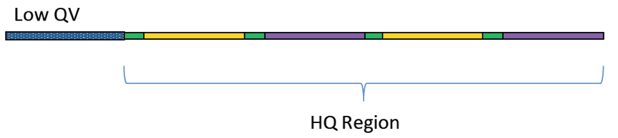
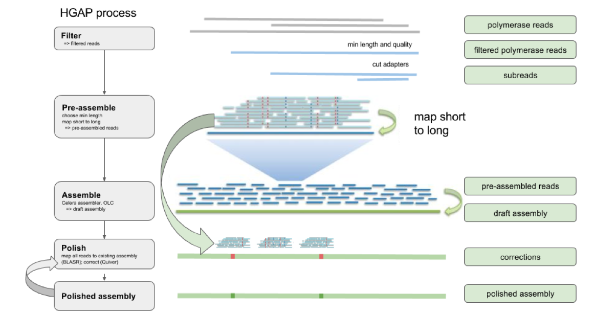

```{r setup, include=FALSE}
knitr::opts_chunk$set(echo = TRUE, fig.align="center")
```

***

```
If you are not familiar with the glossary of Pacbio technology, please also refer to 'Pacbio Terminology' PDF on the right-top corner
```

# Library Preparation Part  

### Pipeline of Experiment

Genomic DNA is extracted and fragmented randomly and then required length DNA fragments are retained by electrophoresis. And after this, we ligate adapters to DNA fragments then conduct cluster preparation, sequencing finally. The library preparation method and sequencing pipeline is shown below.

<br>

```{r, out.width = "600px", echo=FALSE, message=FALSE, warning=FALSE}
knitr::include_graphics("images/PB_lib_pipe.png")
```

<br>

Figure 1: Pipeline of experiment. 
For the PacBio library construction and sequencing, genomic DNA was sheared using a Covaris g-TUBE followed by purification via binding to pre-washed AMPure PB beads (Part Number: PB100-265-900).After end-repair, the blunt adapters were ligated, followed by exonuclease incubation to remove all un-ligated adapters and DNA. The final SMRT bells were annealed with primers and bound to the proprietary polymerase using the PacBio DNA/Polymerase Binding Kit P6 v2 (Part Number PB100-372-700) to form the Binding Complex. After dilution, the library was loaded onto the instrument with DNA Sequencing Kit 4.0 v2 (Part Number PB100-612-400) and a SMRT Cell 8Pac for sequencing. A primary filtering analysis was performed with the RS instrument, and the secondary analysis was performed using the SMRT analysis pipeline version 2.3.0.

***

# Sequencing Part

<br>

### SMRTbell™ template

A double-stranded DNA template capped by hairpin adapters (i.e., SMRTbell adapters) at both ends.

<br>

```{r, out.width = "400px", echo=FALSE, message=FALSE, warning=FALSE}
knitr::include_graphics("images/SMRTBell.png")
```

***

### Primary analysis

#### (Polymerase read -> Pre-filtered subreads)

On-instrument analysis which includes signal processing of the movie, base calling of the traces and pulses, and quality assessment of the base calls. Subsequently, it trims the sequences to the high-quality (HQ) regions, identifies adapter, barcode (optional), and control sequence reads, assigns read scores, and outputs the subread data in a BAM file.

<br>

```{r, out.width = "400px", echo=FALSE, message=FALSE, warning=FALSE}

```

***

### Secondary analysis

#### (Pre-filtered subreads -> Post-filtered subreads)

Follows primary analysis and uses basecalled data. It is application-specific, and may include:

- Filtering/selection of data that meets a desired criteria (such as quality, read length, etc.).

- Comparison of reads to a reference or between each other for mapping and variant calling, consensus sequence determination, alignment and assembly (de novo or reference-based), variant identification, etc.

- Quality evaluations for a sequencing run, consensus sequence, assembly, etc.

- PacBio's SMRT Analysis contains a variety of secondary analysis applications including RNA and Epigenomics analysis tools.

<br>

```{r, out.width = "400px", echo=FALSE, message=FALSE, warning=FALSE}
knitr::include_graphics("images/Secondary_analysis.png")
```

***

### How HGAP assembly work

HGAP, The Hierarchical Genome Assembly Process (HGAP) for long single pass reads generated by the PacBio® Single Molecule Real Time (SMRT) sequencer was developed to allow the complete and accurate shotgun assembly of bacterial sized genomes. The three main steps involved in HGAP are preassembly, assembly, and consensus polishing.

If you need more detail information, please visit Pacbio official github website:
[Pacbio HGAP wiki](https://github.com/PacificBiosciences/Bioinformatics-Training/wiki/HGAP)

<br>

```{r, out.width = "800px", echo=FALSE, message=FALSE, warning=FALSE}

```

***
